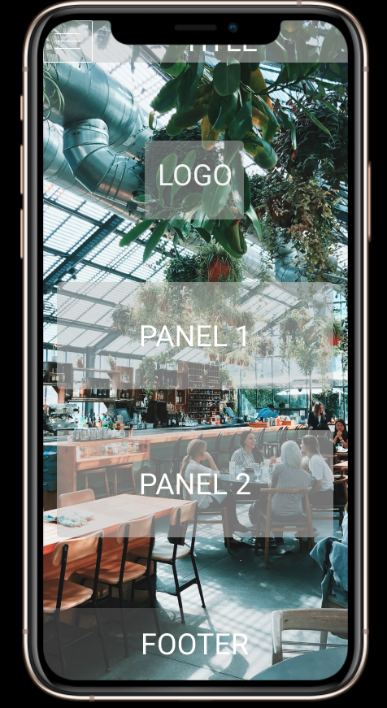

# 	HABIBI (bobo vibes/coffee and lunch)

The goal is to create a restaurant website using [Bootstrap ](https://getbootstrap.com/) in 4 days.

To see the final result [click here](https://guillaume-leo.github.io/restaurant-css-framework/)

######  Instructions:

The website must be **responsive**, at least for small and medium screens. It must at least have five accessible pages: welcome, menu, pictures, restaurants and contact.

* Welcome

  A page with one *Jumbotron* and two panels to show news (promo, events, etc…).

* Menu

  A page with the restaurant menu in the form of a grouped list with badges.

* Pictures

  A page with a gallery of minimum 10 pictures and a pagination (3 photos per page).

* Restaurant

  A page about the restaurants (it’s a franchise) with its addresses, a map, and different schedules.

* Contact

  A page with a contact form containing the firstname, lastname, email, subject of the message (a drop-down list with multiple options), an area for the message itself and a send button with an icon. Each entry as a title in a semantically correct tag.

  ###### My Adventure:

  First I tried to find inspiration by visiting some websites : 

  * [Pardon](https://www.pardonbrussels.com/)
* [Kokuban](https://www.kokuban.be/)
  * [Belga and Co](https://www.belgacoffee.com/)

  Then I tried to create a "draft" using [Figma](www.figma.com) to have an idea of where I was going to.

  I really liked working with Figma but it was my second time so the result was not satisfying in my opinion. 
  
  I think I didn't spent enough time on this part, because at the end the result is too much different.
  
  Here is the result of what I did : 
  
  
  
  
  
  

I didn't like the picture I found on unsplash, I replaced them by drawings made by my girlfriend.

###### HTML/BOOTSTRAP/CSS PART:

 I tried to do the website in mobile first. I had a problem with bootstrap.

The mistake I made was to isolate each element in a container. So at the end nothing was responsive. 

I had to start all again with a new strategy so I lost a lot of time. The result is far from my expectations, but I learnt a lot during this challenge, next time will be better :)

